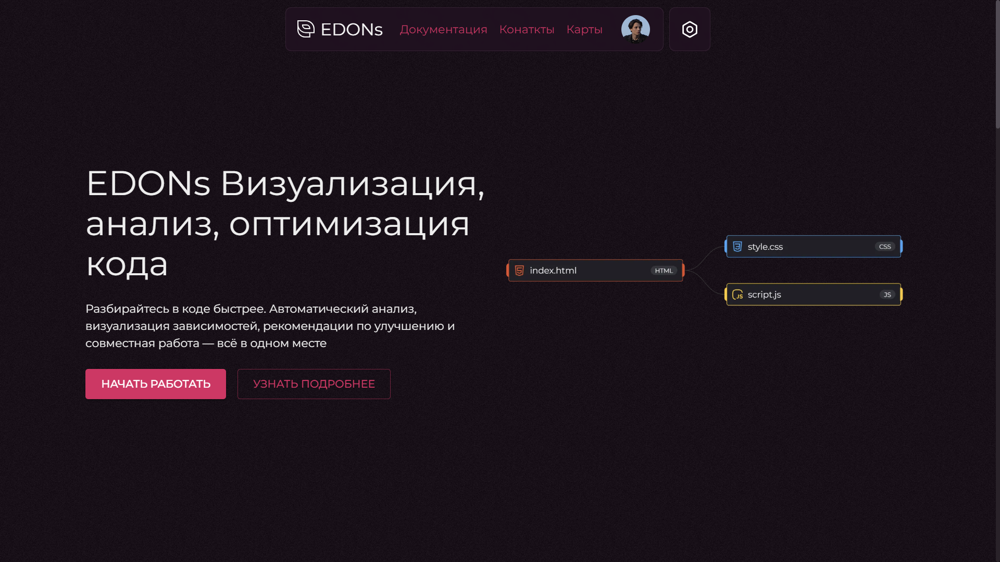
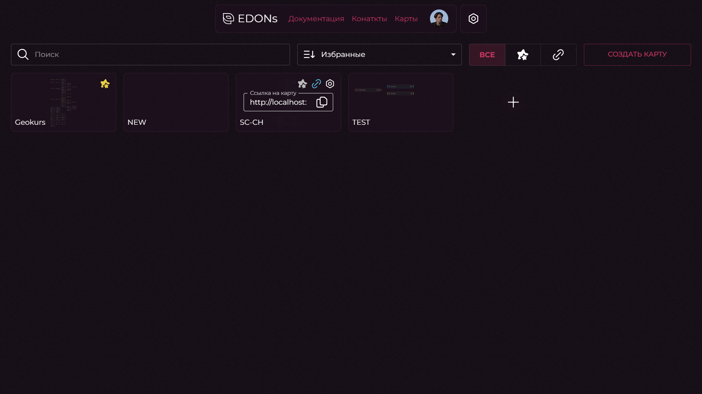
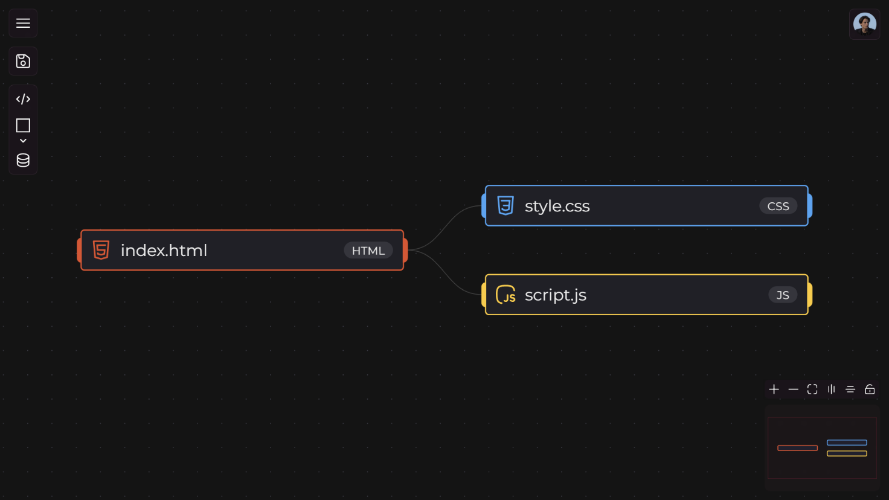
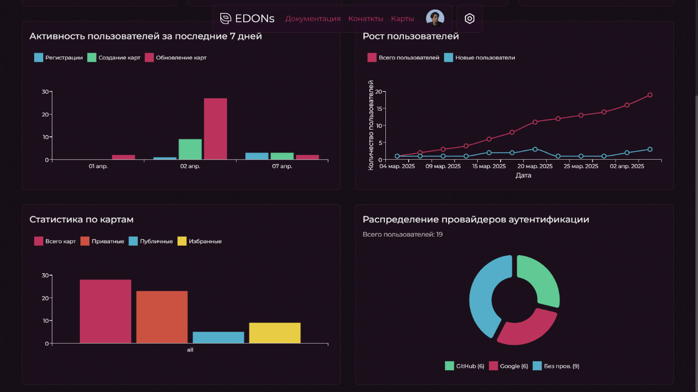

<div align="center">

# EDONs
### Enhanced Development Organizer Navigator System

Интерактивная платформа для анализа, визуализации и совместного редактирования архитектуры программных проектов

[](https://nextjs.org/)
[](https://react.dev/)
[](https://www.typescriptlang.org/)
[](https://www.mongodb.com/)
[](https://socket.io/)

</div>

---

## О проекте

**EDONs** (Enhanced Development Organizer Navigator System) — веб-платформа, которая автоматически строит архитектурную карту программного проекта на основе репозитория Git/GitHub и превращает её в интерактивную, редактируемую схему. Пользователи могут анализировать структуру кодовой базы, документировать связи между модулями, вести совместную работу над схемами в реальном времени и экспортировать результат.

Платформа решает типичные проблемы команд разработки: долгий онбординг новых сотрудников, низкую прозрачность архитектуры унаследованных проектов и отсутствие единого инструмента для анализа, визуализации и обсуждения структуры кода.

> Проект изначально разрабатывался как дипломная работа по направлению «Программная инженерия» и впоследствии развивается как самостоятельный продукт с открытым исходным кодом.

## Возможности

- **Импорт из GitHub** — автоматическое построение графа архитектуры на основе дерева файлов репозитория, импортов, экспортов и зависимостей между модулями.
- **Интерактивный редактор схем** — холст на базе React Flow с поддержкой масштабирования, мини-карты, направляющих линий, drag-and-drop и горизонтальной/вертикальной ориентации схемы.
- **Несколько типов узлов**:
  - *Код* — узел с подсветкой синтаксиса (CodeMirror 6) и привязкой к языку программирования;
  - *Фигуры* — набор геометрических примитивов (прямоугольник, ромб, цилиндр, стрелка и др.) с изменяемым размером;
  - *Таблицы* — узлы с настраиваемыми полями и портами связей.
- **Совместная работа в реальном времени** — синхронизация курсоров, перемещений и изменений узлов между всеми участниками через WebSocket (Socket.IO).
- **Карты проектов** — создание, поиск, сортировка, избранное и публичный доступ по ссылке; экспорт схемы в PNG.
- **Аутентификация и сессии** — вход по логину/паролю или через OAuth (Google, GitHub), привязка нескольких провайдеров к одному аккаунту, JWT-сессии с обновлением токенов.
- **Административная панель** — статистика платформы (рост пользователей, активность за 7 дней, статистика по картам, провайдерам аутентификации), журнал событий, управление пользователями и картами с фильтрацией и сортировкой.
- **REST API** — единая точка взаимодействия между клиентом, базой данных и внешними сервисами авторизации.

## Технологический стек

| Слой | Технологии |
|---|---|
| Язык | JavaScript, TypeScript |
| Клиент | React 19, Next.js 15 (SSR/SSG), MUI, SCSS, styled-components, React Flow, CodeMirror 6 |
| Сервер | Next.js API Routes, Node.js 18+, MongoDB, Mongoose, Socket.IO |
| Аутентификация | NextAuth.js (OAuth: Google, GitHub), JWT, bcryptjs |
| Вспомогательные библиотеки | Axios, Zod, clsx, crypto-js |
| Качество и тестирование | ESLint, Prettier, Jest, React Testing Library |
| Инфраструктура | Docker, Docker Compose |

## Архитектура

Платформа построена по архитектурному паттерну **MVC**:

- **Model** — структуры данных MongoDB (пользователи, карты, узлы/связи схем, журнал действий, OAuth-аккаунты), доступ через Mongoose.
- **View** — React-компоненты с поддержкой тематизации и адаптивной верстки.
- **Controller** — API Routes Next.js, обрабатывающие запросы, авторизацию и бизнес-логику.

Дополнительные архитектурные решения:

- **SPA + SSR** — комбинация клиентского рендеринга и серверного рендеринга Next.js для быстрого отклика интерфейса и SEO.
- **Real-time через паттерн Observer** — выделенный WebSocket-сервер хранит состояние карты («комнаты»), а клиенты подписываются на изменения и мгновенно синхронизируют состояние интерфейса.
- **SSO / OAuth 2.0** — авторизация через Google и GitHub с автоматическим созданием или привязкой учётной записи и stateless-сессиями на базе JWT.

### Основные сущности данных

| Сущность | Назначение |
|---|---|
| `User` | Учётные данные, профиль, роль (admin/user), привязанные OAuth-аккаунты |
| `AccountProviders` | OAuth-аккаунты пользователя (GitHub, Google) и их токены |
| `Map` | Архитектурная карта: владелец, настройки, признаки избранного/публичного доступа |
| `NodeData` | Узлы и связи конкретной карты |
| `Log` | Журнал действий пользователей и системных событий |

### Размещение

- **VPS-сервер**: Next.js-приложение (REST API + SSR) и отдельный WebSocket-сервер (Socket.IO).
- **MongoDB**: на том же сервере либо на отдельном хосте.
- **OAuth-провайдеры**: Google и GitHub — внешние сервисы, доступ по HTTPS.
- **Клиенты**: современные веб-браузеры с поддержкой WebSocket.

## Скриншоты

<table>
<tr>
<td><br/><sub>Главная страница</sub></td>
<td><br/><sub>Карты пользователя</sub></td>
</tr>
<tr>
<td><br/><sub>Интерактивный редактор схем</sub></td>
<td><br/><sub>Административная панель</sub></td>
</tr>
</table>

## Требования

**Сервер**

- Node.js 18+
- MongoDB (локальный или удалённый инстанс)
- ОС: Linux Ubuntu 20.04+ / Debian 10+ / Windows Server 2019+
- Открытые порты: 80/443 (HTTP/HTTPS), 3000 (приложение), 3005 (WebSocket-сервер)

**Клиент**

- Современный браузер с поддержкой ES6, WebSocket: Chrome 90+, Firefox 88+, Edge 90+, Safari 14+
- Разрешение экрана от 1280×720 (рекомендуется 1920×1080)

## Быстрый старт

### 1. Клонирование репозитория

```bash
git clone https://github.com/EvhoLF/edons.git
cd edons
```

### 2. Установка зависимостей

```bash
npm install
```

### 3. Настройка окружения

Создайте в корне проекта файл `.env.local`:

```env
MONGODB_URI=mongodb://localhost:27017/edons

NEXTAUTH_URL=http://localhost:3000
NEXTAUTH_SECRET=your_nextauth_secret

GITHUB_ID=your_github_client_id
GITHUB_SECRET=your_github_client_secret

GOOGLE_ID=your_google_client_id
GOOGLE_SECRET=your_google_client_secret
```

Для получения OAuth-ключей:

- **GitHub**: GitHub → Settings → Developer settings → OAuth Apps → New OAuth App.
- **Google**: Google Cloud Console → APIs & Services → Credentials → OAuth 2.0 Client IDs.

### 4. Запуск MongoDB

```bash
sudo systemctl start mongod
```

### 5. Запуск в режиме разработки

```bash
npm run dev   # веб-приложение (Next.js)
npm run ws    # WebSocket-сервер для совместной работы
```

Приложение будет доступно по адресу `http://localhost:3000`.

### 6. Production-сборка

```bash
npm run build
npm run start
```

### Запуск через Docker

В проекте присутствуют `Dockerfile` и `docker-compose.yml` для контейнеризованного развёртывания:

```bash
docker compose up --build
```

## Структура проекта

```
edons/
├── app/            # Страницы и маршруты Next.js (App Router), API Routes
├── components/     # React-компоненты интерфейса
├── data/           # Модели и схемы данных
├── hooks/          # Пользовательские React-хуки
├── libs/           # Конфигурация интеграций (NextAuth, MongoDB и др.)
├── public/         # Статические файлы
├── styles/         # Глобальные стили и SCSS-модули
├── utils/          # Вспомогательные функции
├── DB/             # Скрипты/конфигурация базы данных
├── ws_server.js    # WebSocket-сервер для совместной работы
├── middleware.ts   # Middleware (авторизация, маршрутизация)
├── Dockerfile
└── docker-compose.yml
```

## Тестирование

Модульное и интеграционное тестирование реализовано с использованием **Jest** и **React Testing Library**: проверяется бизнес-логика, API-запросы, авторизация (OAuth/JWT) и взаимодействие с базой данных.

```bash
npm run test
```

## Дальнейшее развитие

- Поддержка дополнительных языков программирования при статическом анализе.
- Интеграция с CI/CD-системами.
- Расширенные метрики архитектурной сложности и технического долга.
- Гибкая система ролей и прав доступа.

## Лицензия

Лицензия проекта будет добавлена дополнительно. До тех пор все права на код принадлежат автору репозитория.

## Автор

[EvhoLF](https://github.com/EvhoLF)
